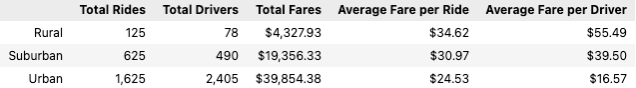
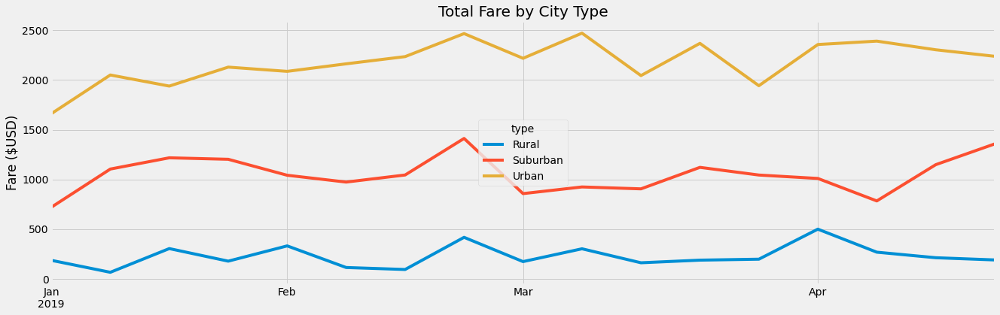

# PyBer Analysis
## Challenge 5: Matplotlib
### Overview
#### Purpose
This challenge analysis was based on the results from merging two .csv files into one dataframe. The two files contained the following information:
1. City Data: this data included the names of cities, how many drivers are in each city, and the type of city: urban, suburban, and rural.
2. Rider Data: this data included a date and timestamp for each ride, the cost of each ride, a ride identification to distinguish each ride, and the city that the ride took place.
When merging this data together, we are able to analyze:
1. How many rides took place per city type
2. How many drivers there are per city type
3. How much fare is and the average fare per city type

Our merged data is below:                        

#### Additional analysis
In addition, we took a look at a segment of data produced across 4 months: January 1, 2019 through April 29, 2019. This data was then plotted onto a multi-line chart with results per week.

Our multi-line chart is below:

#### Results
The different city types display very different data:
- While urban cities lead with the most amount of rides and the greatest fare collected overall, the cost of each ride and salary to the driver is far less.
- While rural cities have the least amount of rides and the lowest fare collected overall, the cost of each ride and salary to the driver is the highest.
- Suburban cities are right in the middle of all of the data: not the highest number of rides, nor lowest; not the highest number of drivers nor lowest; not the highest cost of fare and salary to the driver, nor lowest.

#### Business Recommendations
While it is evident that the cost of fares increases with a decrease in the number of rides and drivers, we may still be missing some measurements that may answer why this is the case. Why do urban cities collect more total fare while the cost of each ride and the salary per driver is less? Conversely, why do rural cities collect the least total fare while the cost of each ride and salary per driver is more? To get a more accurate picture, we should take an additional look at:
1. The number of cities per type: if each city type were to have the same amount of cities represented in the data, would we see different results?
2. Whether certain cities skew the data for each city type: offering far fewer rides/far greater, or charging far less per ride/far greater
3. The length of each trip: longer rides may imply an increase in the cost of fare which may be why rural rides are more expensive
4. The time of year when more trips take place: in January, each city type collects a bit less in fares; why is that? Can the data tell us?
